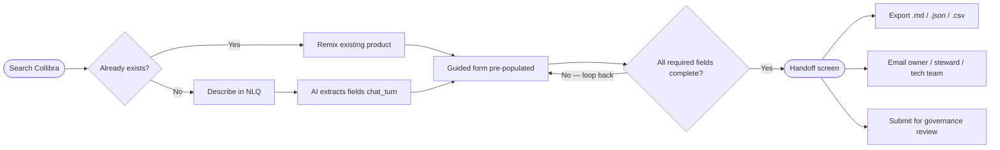
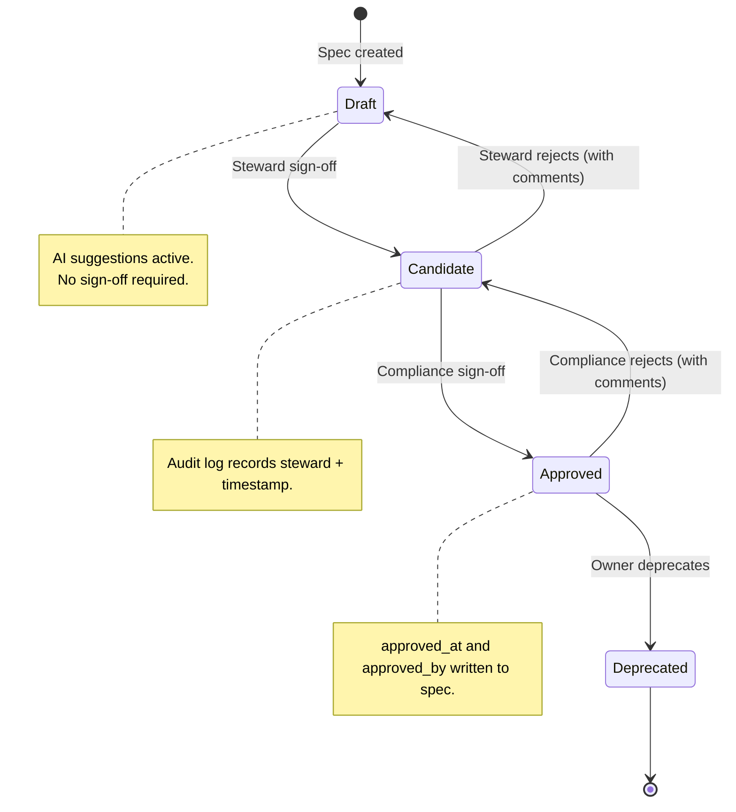
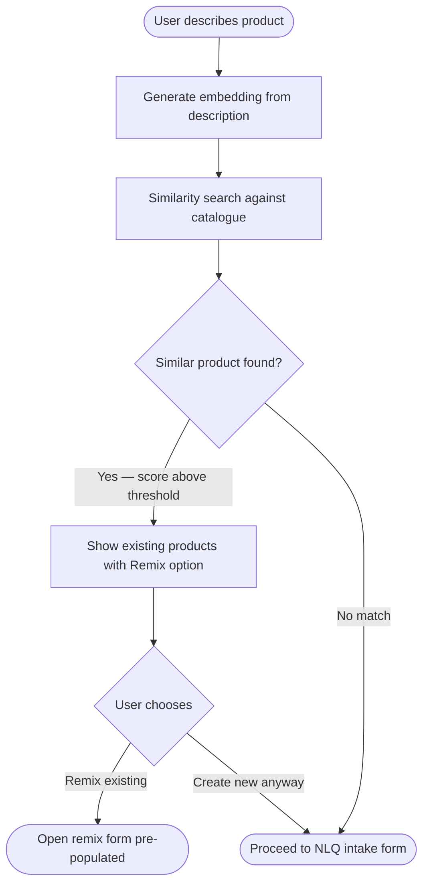
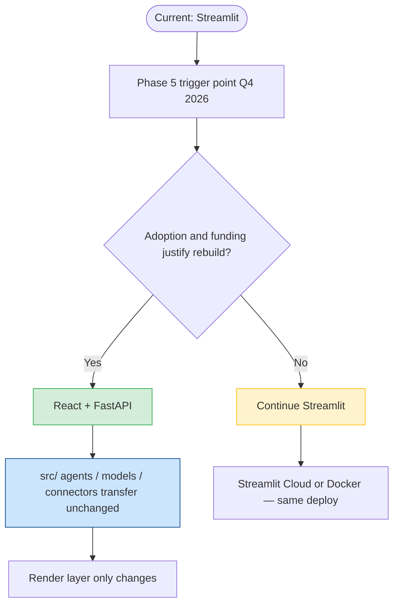

# Data Product Concierge — Product Roadmap

```
  ╔═══════════════════════════════════════════════════════════════════╗
  ║  From a blank 35-field form to an AI-guided review.              ║
  ║  This is where we are, what comes next, and how we get there.    ║
  ╚═══════════════════════════════════════════════════════════════════╝
```

> **Part One** — Business case, delivered value, and next features.
> **Part Two** — Technical detail for the engineering team.

```
  Status:  ✅ Shipped   🗓 Planned (date targeted)   💡 Proposed (not yet scoped)
```

---

# Part One — The Business Story

---

## Delivery Timeline

> **Note:** Delivery dates and sprint allocation are tracked in Excel. The phase groupings below reflect actual build order — not projected calendar dates.

| Phase | Status | What shipped |
|-------|--------|-------------|
| Phase 0 — Foundation | ✅ Done | Data model, Collibra connector, APIM auth, async utils, field registry |
| Phase 1 — AI Wiring | ✅ Done | NLQ intake, `chat_turn` extraction, `explain_field`, `validate_and_normalise`, `explain_field_impact`, APIM-routed LLM |
| Phase 2 — UX | ✅ Done | Guided card form, 💡 suggestion badges, disambiguation flow, ⚡ governance banners, handoff summary, draft autosave, exports |
| Phase 3 — Governance | 🗓 Next | Approval workflow, role-scoped visibility, steward notifications |
| Phase 4 — Discovery | 🗓 Planned | Duplicate detection, embedding similarity, lineage graph |
| Phase 5 — Enterprise | 🗓 Planned | React + FastAPI rebuild (decision gated on adoption), SSO, RBAC |
| Phase 6 — AI Agents | 🗓 Horizon | Autonomous quality scoring, proactive gap detection |

---

## The Problem We Solved

Registering a data product meant opening a 35-field governance form. Most fields had constrained values pulled from Collibra that no one outside the governance team had seen before. There was no guidance, no context, no indication of which fields applied to which role.

The practical result: incomplete registrations, invalid enum values in Collibra, and a handoff process that relied on emails and attachments with no audit of what changed or who changed it.

---

## What We Built and What Changed

```
  BEFORE                              NOW
  ──────────────────────────────────  ─────────────────────────────────────
  Blank 35-field form                 Describe your data product in plain
                                      English → AI extracts what it can
                                      → you confirm each suggestion

  Free-text entry for constrained     AI fuzzy-matches your input to
  fields → invalid values enter       canonical Collibra values.
  Collibra                            Confidence-gated: high confidence
                                      accepted silently, medium asks you
                                      to confirm, low passes through with
                                      a warning. Only runs in live mode
                                      on option fields.

  No guidance on any field            One-line context-aware hint below
                                      every field label, specific to your
                                      domain and classification

  Changing a classification had no    ⚡ Amber banner explains the
  visible governance consequence      governance implication before you
                                      confirm the change. Only fires on
                                      4 specific governance-trigger fields.

  Handoff = email + JSON attachment   Shareable link with role parameter
                                      — recipient opens the draft directly.
                                      Role-based field routing is the
                                      next phase (see Phase 3).

  No summary at completion            AI-generated personalised summary
                                      at the handoff screen, cached per
                                      spec so it doesn't re-call on reload

  No export                           Download as Markdown, Collibra JSON,
                                      or Snowflake CSV at any point
```

---

## What Is Live Today  ✅

```
  ┌───────────────────────────────────────────────────────────────┐
  │                                                               │
  │   DISCOVER        CREATE           GOVERN        HAND OFF    │
  │                                                               │
  │  Search Collibra  Describe it  →   Remix with   Email owner  │
  │  before creating  AI pre-fills     ⚡ impact     Tech team   │
  │                   the form         banners       Steward     │
  │                       ↓                ↓             ↓       │
  │                  Review 💡         Confirm or   Export       │
  │                  suggestions       override     .md .json    │
  │                  not type them                  .csv         │
  └───────────────────────────────────────────────────────────────┘
```

### Full User Journey — What's Shipped



---

### What is verifiably true today

| What | What it does | What it does not do (yet) |
|------|-------------|--------------------------|
| NLQ intake | Extracts fields from a plain-English description via GPT-4o. Only populates blank fields — never overwrites data you've entered. | Cannot guarantee how many fields it extracts. Depends on how much detail you provide. |
| Fuzzy enum matching | Matches free-text input to canonical Collibra values with a confidence score. Threshold enforced in Python, not by the model. | Only runs on option fields in the guided form path, only in live mode. |
| Context-aware hints | One-line field explanation generated by AI, cached so it doesn't call the model twice for the same field + context. | Falls back to static registry text on timeout or error. Not AI in demo mode. |
| Governance impact banners | Shows implication when you change classification, PII flag, regulatory scope, or data sovereignty flag on the remix path. | Only those 4 fields. Returns nothing for immaterial changes. |
| Handoff deep link | `?draft_id=...&role=tech` opens the draft in a role-scoped session. | The form does not yet filter visible fields by role. That is Phase 3. |
| Completion summary | AI-narrated summary at the handoff screen. | Does not block submission. Falls back to no summary card if the LLM call fails. |
| Exports | Markdown, Collibra JSON, Snowflake CSV — generated from the spec model. | These are downloads. Nothing is written back to Collibra automatically. |
| Audit trail | Every field change logged in `DraftManager` with timestamp and session ID. | Requires a database connection (Postgres via `POSTGRES_DSN`). Not available without it. |

---

## What Ships Next  🗓

Three features that address the biggest remaining gaps.

---

### 1 — Formal Approval Workflow
**Target: Q2 2026**

```
  TODAY                               NEXT
  ──────────────────────────────────  ──────────────────────────────────
  Submit button sends the spec.       Draft → Candidate → Approved
  No formal review gate.              → Deprecated lifecycle.
  No visibility of what state         Each transition requires a sign-off
  a product is in post-submission.    from a specific role.
                                      Email notification at each step.
                                      Audit log records who approved
                                      what and when.
```

**Why this matters:** Without a formal gate, submission is indistinguishable from approval. Governance requires traceability of who signed off on what.

**What it needs:** State machine on `DraftManager`, email notification on each transition, role-based sign-off logic.

#### Approval Workflow State Machine



---

### 2 — Role-Scoped Field Visibility
**Target: Q2 2026**

```
  TODAY                               NEXT
  ──────────────────────────────────  ──────────────────────────────────
  Deep link captures the role.        Business role → sees only
  The form shows all fields           business fields.
  regardless of who opened it.        Tech role → sees only tech fields.
                                      Steward → sees everything.
                                      Role inferred from URL param
                                      until SSO is available.
```

**Why this matters:** The handoff only works if the tech team sees what they need to fill in, not a full 35-field form they weren't involved in designing.

**What it needs:** Role-to-field-group mapping in `field_registry.py`, routing logic in `guided_form.py` and `chapter_form.py`.

---

### 3 — Duplicate Detection Before Creation
**Target: Q3 2026**

```
  User describes: "Payments fraud detection for Risk team"
       ↓
  Before the form opens:
  ┌──────────────────────────────────────────────────────┐
  │  ⚠  Similar products already exist:                 │
  │                                                      │
  │  · Payments Fraud Detection Daily                   │
  │    Risk domain · GDPR · Updated monthly            │
  │    [ View ]  [ Remix this instead → ]               │
  │                                                      │
  │  [ Create new anyway → ]                            │
  └──────────────────────────────────────────────────────┘
```

**Why this matters:** Catalogue sprawl happens before creation, not after. Surfacing similar products at the point of intent prevents duplicates without blocking legitimate new products.

**What it needs:** Vector embeddings on existing asset descriptions, similarity search against Collibra before NLQ intake submits.

#### Duplicate Detection Flow



---

## The Longer Horizon  🗓

```
  Q2 2026             Q3 2026             Q4 2026             2027
  ─────────────────   ─────────────────   ─────────────────   ──────────────────
  Approval workflow   Duplicate           Collibra            Autonomous field
                      detection           write-back          research
  Role-scoped                             (direct API         (AI pre-fills
  field visibility    Semantic search     POST on submit,     lineage from
                      (vector             not just export)    catalogue)
  Governance rules    embeddings)
  engine                                  Snowflake DDL       Regulatory change
                      Lineage             generation          monitoring
                      visualisation
                                          Slack / Teams       Proactive quality
                      Maturity            notifications       alerts
                      scoring
                                          SSO + RBAC
```

---

## The Platform Question — Streamlit Now, React Later

The current application is built on **Streamlit** — a Python-first framework that let us ship the full product, including all AI wiring, before a traditional frontend build would have reached first demo.

The honest assessment:

```
  STREAMLIT (NOW)                     REACT + API (IF AND WHEN JUSTIFIED)
  ──────────────────────────────────  ──────────────────────────────────
  ✅ Full product shipped              ✅ Real-time co-editing via WebSocket
  ✅ All AI methods wired              ✅ Role-based field visibility
  ✅ No frontend/backend split         ✅ Native SSO / RBAC at the HTTP layer
  ✅ One codebase, one deployment      ✅ Mobile layout
  ✅ Demo mode out of the box          ✅ Custom component library
                                       ✅ No full-page rerun on every action
  ⚠  Full page reruns on interaction
  ⚠  No WebSockets — co-edit is       ⚠  Longer build and QA cycle
     polling-based or deferred         ⚠  Requires frontend engineers
  ⚠  Streamlit Cloud controls         ⚠  Two deployments to maintain
     the runtime version
```

**The key fact:** Every concierge method, every Pydantic model, every Collibra connector, and the entire AI pipeline lives in `src/` — it has no Streamlit dependency. A React rebuild replaces the render layer only. The logic transfers as-is.

**Recommendation:** Streamlit through Q3 2026. Phase 5 (Q4 2026 — Collibra write-back, SSO, production-grade RBAC) is the natural inflection point to evaluate a React + FastAPI split, if adoption and funding justify the investment. There is no deadline to rebuild — only a trigger.

#### Streamlit → React Decision Path



---
---

# Part Two — Technical Detail

---

## Phase 0 — Foundation  ✅  *(Shipped)*

> Nothing visible to users. Everything the product depends on.

**Application**
- ✅ Streamlit orchestrator — session state, routing, demo/live mode switching
- ✅ `src/` package layout with `sys.path` bridge from project root
- ✅ `_app_state_version` guard — clears widget state on Streamlit version change, prevents selectbox deserialisation errors
- ✅ `_demo_active()` — zero API and LLM calls in demo mode across all 6 AI touchpoints

**Data model**
- ✅ Pydantic v2 `DataProductSpec` — 35+ fields, full validation, enums for all constrained values
- ✅ `to_collibra_json()`, `to_snowflake_csv()`, `to_markdown()` serialisation methods
- ✅ `completion_percentage()`, `required_missing()`, `optional_missing()` — computed spec health
- ✅ `core/field_registry.py` — single source of truth for field metadata, labels, questions, options, owners

**Infrastructure**
- ✅ `core/async_utils.run_async(coro, timeout)` — single shared async bridge, never redefined locally
- ✅ APIM token manager with cache and sync `get_llm_headers()`
- ✅ Collibra OAuth2 client
- ✅ asyncpg connection pool with `ConcurrentEditError` optimistic locking
- ✅ `DraftManager` — spec JSON persistence, role metadata, audit log

**LLM routing — three backends, one interface**
- ✅ Direct OpenAI `AsyncOpenAI` — GPT-4o via `OPENAI_API_KEY`
- ✅ AWS Bedrock Claude — `boto3.client("bedrock-runtime")`
- ✅ APIM-routed Azure OpenAI — `AsyncAzureOpenAI`, per-call APIM headers via `LLM_VIA_APIM=true`

---

## Phase 1 — AI Wiring  ✅  *(Shipped)*

> Six AI touchpoints. Each guarded, cached, and fallback-safe.

**NLQ → spec**
- ✅ `nlq_intake.py` — plain-English text area before guided form
- ✅ `chat_turn()` on intake — extracts fields via GPT-4o in `json_mode=True`
- ✅ `_apply_extracted_to_spec()` — skips any field where `current is not None/empty`. AI cannot overwrite user data.
- ✅ `ai_suggested_fields` set in session state — drives 💡 badge. Badge removed on accept or override.

**Enum matching**
- ✅ `validate_and_normalise()` in Continue handler — option fields only, live mode only
- ✅ Confidence clamped in Python: `min(1.0, max(0.0, score))`
- ✅ `matched = None` if `confidence < 0.7` — enforced in Python, not by model
- ✅ Medium confidence (0.4–0.7): `Did you mean "X"?` with confirm/keep — button shows actual value

**Field guidance**
- ✅ `explain_field()` — one-sentence hint, cached per `(field, domain[:10], cls[:10])`
- ✅ Falls back to static `field_registry` explanation on timeout or error

**Governance impact**
- ✅ `explain_field_impact()` — fires on `data_classification`, `pii_flag`, `regulatory_scope`, `data_sovereignty_flag` only
- ✅ Cached by `(field, hash(old), hash(new))` — one LLM call per unique change per session
- ✅ Code strips "no significant implications" responses — no banner for immaterial changes

**Completion summary**
- ✅ `generate_completion_message()` at handoff — cached by spec name, one call max per session
- ✅ Rendered in teal card above handoff screen. Absent (silently) if call fails.

**Conversational chat path**
- ✅ `is_complete=True` from `chat_turn()` auto-triggers handover screen
- ✅ `st.spinner("Thinking…")` wraps every `chat_turn()` call
- ✅ `asyncio.TimeoutError` caught separately from `Exception` — timeout is expected under load
- ✅ All exception handlers log `exc_info=True`

---

## Phase 2 — UX  ✅  *(Shipped)*

**Handoff screen**
- ✅ Completion bar — green ≥80% · amber ≥50% · red <50%
- ✅ 3-card grid: Fields Complete · Optional Missing · Required Missing
- ✅ Submit disabled with explicit instruction: *"Click ← Go back and edit below"*
- ✅ Assign panel — Data Owner, Tech Team, Steward, Compliance presets with role-specific email body
- ✅ `mailto:` link button, sent-this-session log
- ✅ Shareable deep link with `draft_id` and `role` params
- ✅ Audit trail expander — requires Postgres connection

**Exports** — Markdown · Collibra JSON · Snowflake CSV · inline download in chat path

**Deployment**
- ✅ `streamlit` removed from `requirements.txt` — platform manages runtime
- ✅ `packages.txt` deleted — asyncpg uses pre-built wheels on Python 3.12 / Linux x86_64
- ✅ `runtime.txt` — `python-3.12`
- ✅ `requirements-dev.txt` — test deps separated from production

---

## Phase 3 — Collaboration  🗓  *(Q2 2026)*

- 🗓 Role-to-field-group mapping — business/tech/steward see their own sections
- 🗓 Route on URL `role` param to correct form component
- 🗓 `Draft → Candidate → Approved → Deprecated` state machine on `DraftManager`
- 🗓 Role-specific sign-off gates per transition
- 🗓 Email on transition with field diff
- 🗓 `approved_at`, `approved_by` written to spec on approval
- 🗓 Polling-based concurrent edit detection — show "someone else is editing" warning
- 🗓 Governance rules in `field_registry.py` as `FieldRule` Pydantic models, not hardcoded in UI

---

## Phase 4 — Discovery  🗓  *(Q3 2026)*

- 🗓 Vector embeddings on `description` + `business_purpose` fields
- 🗓 Similarity search before NLQ intake — surface existing products, offer Remix
- 🗓 Semantic search alongside Collibra keyword search
- 🗓 Lineage graph from `lineage_upstream` / `lineage_downstream` fields
- 🗓 `score_spec_completeness()` wired into maturity dashboard — per-dimension scores

---

## Phase 5 — Enterprise  🗓  *(Q4 2026)*

- 🗓 Collibra write-back on submit — `POST /assets` + `PATCH /assets/{id}/attributes`
- 🗓 Snowflake DDL from `column_definitions` + `materialization_type` + `schema_location`
- 🗓 Slack / Teams webhook on spec submission
- 🗓 SAML / OIDC via APIM — real identities in audit log, role from claims
- 🗓 React + FastAPI evaluation — `src/` transfers unchanged, render layer only changes

---

## Phase 6 — AI Agents  💡  *(2027 — not yet scoped)*

- 💡 Autonomous lineage and source system research from internal catalogue
- 💡 Regulatory change feed monitoring — flag Approved specs affected by ESMA/FCA/SEC updates
- 💡 Quality score alerting — notify owner when score drops below SLA threshold
- 💡 Natural language spec diff — "what changed between v1 and v2" in plain English

---

*Last updated: March 2026 · Phases 0–2 shipped · Phase 3 in design*
